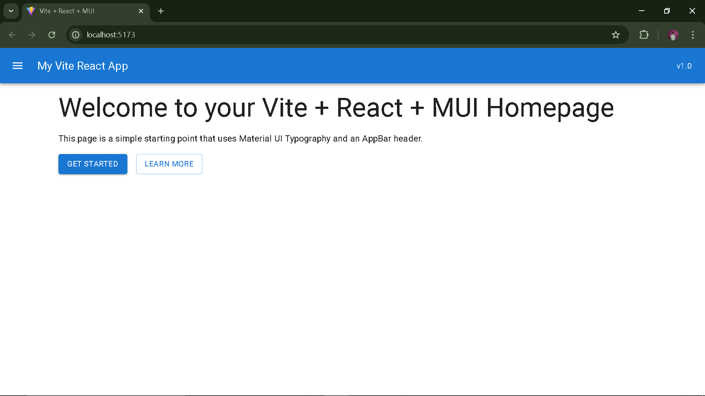

# Week 2 Day 1 - [Sep29]

## Task/Assignment

- Scaffold app
- setup basic folder structure
- Create homepage with MUI Typography and AppBar

## Images



## Steps

Create app (replace `my-react-app` with the folder name)

```bash
npm create vite@latest my-react-app -- --template react
```

Enter folder

```bash
cd my-react-app
```

Install dependencies

```bash
npm install
```

Install Material UI (MUI) + emotion + icons

```bash
npm install @mui/material @emotion/react @emotion/styled @mui/icons-material
```

Start dev server

```bash
npm run dev
```
