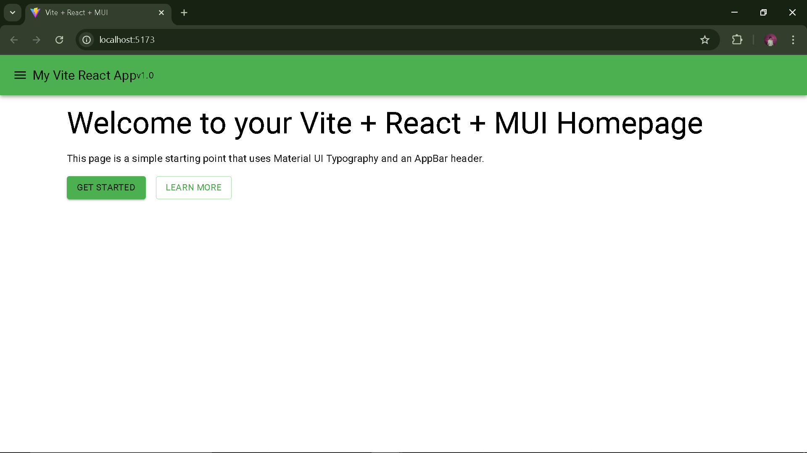

# Week 2 Day 1 - [Sep29]

## Task/Assignment
- Scaffold app
- setup basic folder structure 
- Create homepage with MUI Typography and AppBar

## Images



## Steps

1. Create app (replace `my-react-app` with the folder name)
```
npm create vite@latest my-react-app -- --template react
```
2. Enter folder
```
cd my-react-app
```
3. Install dependencies
```
npm install
```
4. Install Material UI (MUI) + emotion + icons
```
npm install @mui/material @emotion/react @emotion/styled @mui/icons-material
```
5. Start dev server
```
npm run dev
```