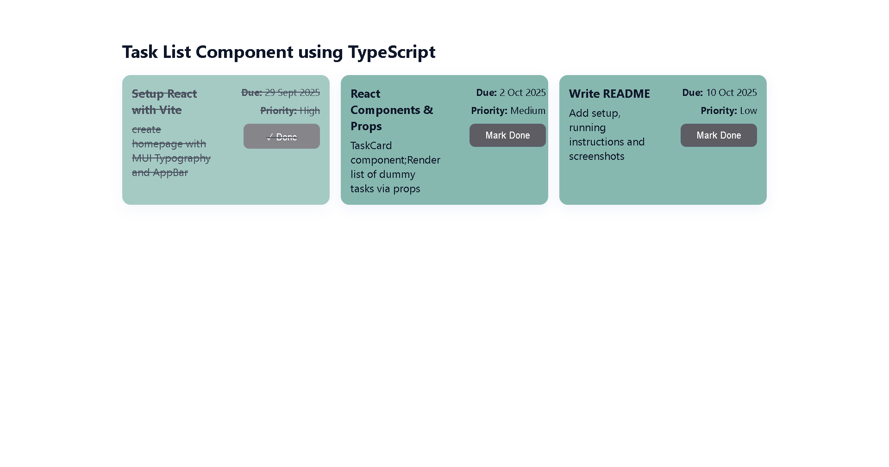

# Week 2 Day 2 - [Oct 1]

## Task/Assignment
- TaskCard component;
- Render list of dummy tasks via props;

## Images

## What I Did in This Task

- Created a TaskCard component in React + TypeScript to display individual tasks.
- Rendered a list of dummy tasks using props passed from the parent App component.
- Added task details such as title, description, due date, and priority.
- Implemented a “Mark Done” feature that lets users toggle the completion state of a task.
- Styled the tasks and button using custom CSS classes for a clean UI.

## How it works

- In App.tsx, an array of dummy tasks is defined and stored in React useState.
- Each task is passed down to the TaskCard component via props.
- The TaskCard displays task info and has a “Mark Done” button.
- When the user clicks the button, it calls a function from App to toggle the task’s completed state.
- Completed tasks are shown with a ✓ Done button label, and strikethrough text.

## Special Feature

- Mark Done Button: If a user completes a task, they can click the button to mark it as done.
- When clicked, the button text changes to “✓ Done.”
- Clicking again can unmark it, returning it to “Mark Done.”