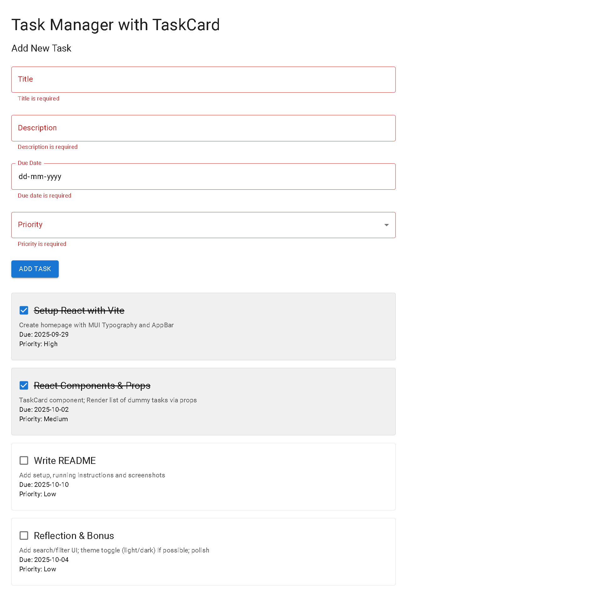

# Week 2 Day 3 - [Oct 1]

## Task/Assignment
- Add ability to add tasks;
- Manage state;
- Fetch effects if needed (dummy), Create form using MUI TextFields and Buttons;
- Validate required inputs / length / number etc.

## Images

## What I Did in This Task

- Created a React + Vite + TypeScript project with Material UI.
- Built a TaskCard component to display tasks.
- Integrated state management using useState to store tasks.
- Implemented a TaskForm component with Material UI TextField, Button, and validation.
- Added ability to add new tasks dynamically with validation.
- Used controlled components for form inputs.
- Added a toggle feature to mark tasks as completed or uncompleted.

## How it works

- When the app loads, it displays a list of initial tasks (dummy data).
- Below it, you see a form where you can:
- Enter a task title
- Add a description
- Select a due date
- Choose a priority (High / Medium / Low)
- The form validates your input (title must have at least 3 chars, all fields required).
- When you click Add Task, the new task is added to the state and shown immediately in the task list.
- Each task is displayed in a TaskCard with details and a mark done toggle.
- Clicking the toggle button updates the task’s completed status.

## Special Feature

- Mark Done Button: If a user completes a task, they can click the button to mark it as done.
- When clicked, the button text changes to “✓ Done.”
- Clicking again can unmark it, returning it to “Mark Done.”