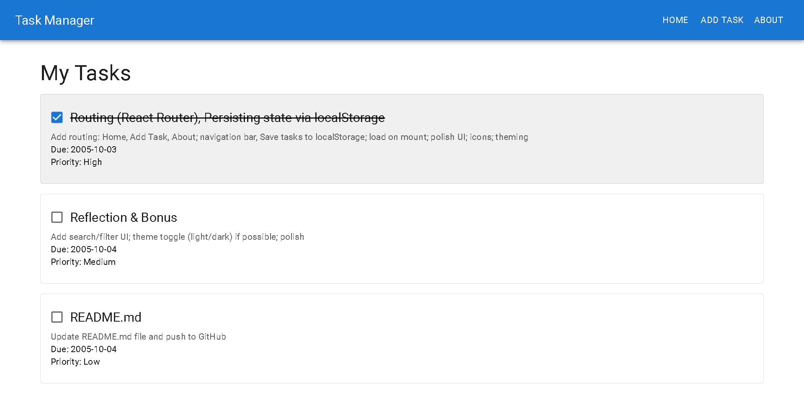
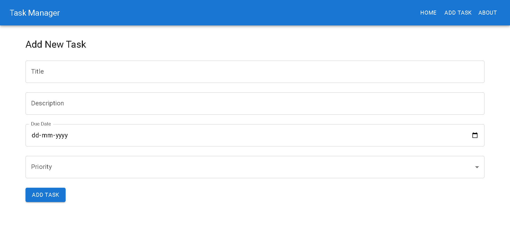
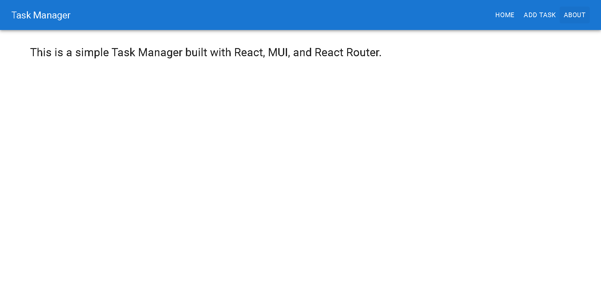

# Week 2 Day 4 - [Oct 3]

## Task/Assignment :
- Add routing: Home, Add Task, About;
- Navigation bar, Save tasks to localStorage;
- Load on mount;
- Polish UI; icons; theming;

## Images :

1. The Home Page of Task Manager


2. The AddTask Page of Task Manager


3. About Page



## Steps :
1. Create project
```
npm create vite@latest react-router -- --template react-ts
```
2. Go into project folder
```
cd react-router
```
3. Install dependencies
```
npm install
```
4. Install Material UI
```
npm install @mui/material @emotion/react @emotion/styled @mui/icons-material
```

## What i did in this task :

- Implemented React Router to add multiple pages: Home, Add Task, and About, allowing smooth navigation across the app.
- Created a navigation bar for easy access to different pages.
- Added functionality to persist tasks in localStorage, ensuring that tasks remain saved even after page reload.
- On app load, tasks are fetched from localStorage and displayed automatically.
- Enhanced the UI/UX with polished styling, icons, and theming for better user experience.

## How It Works :

- Users can navigate between pages using the navigation bar.
- Tasks added via the "Add Task" page are saved in the browser’s localStorage.
- Completed tasks can be marked and remain stored between sessions.
- The app’s UI dynamically updates and maintains a consistent look with theming and icons.