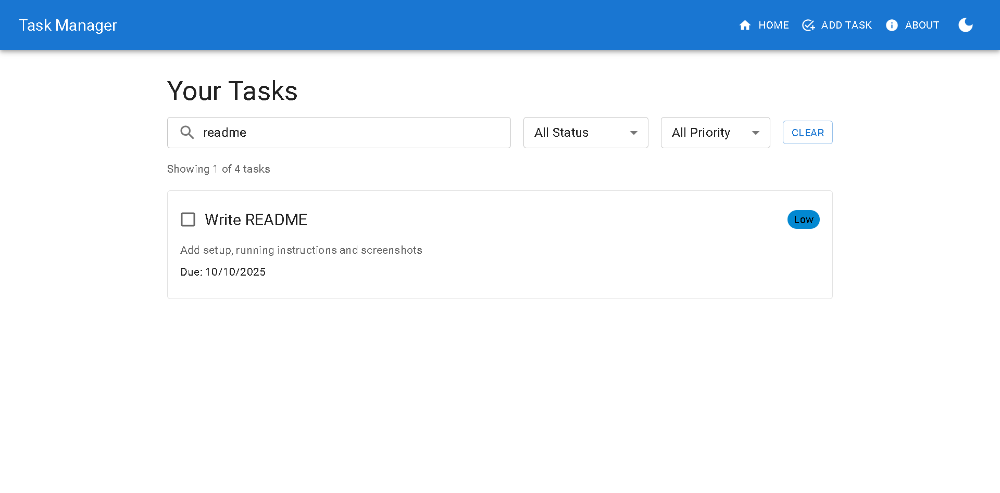
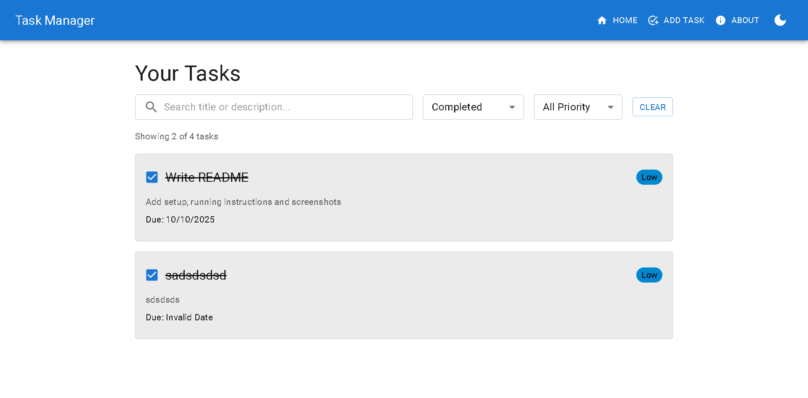
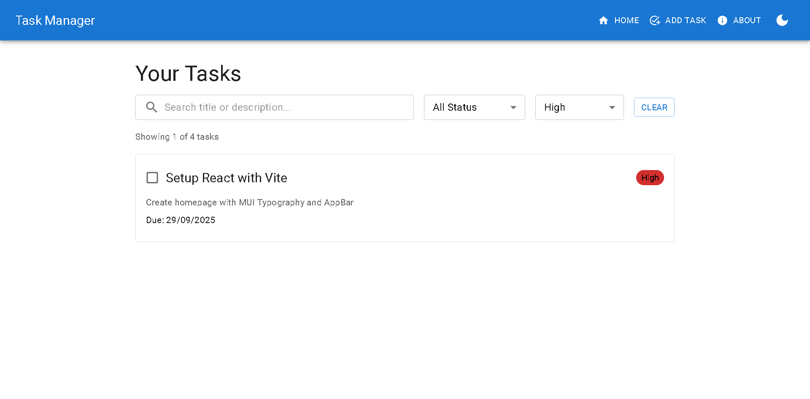
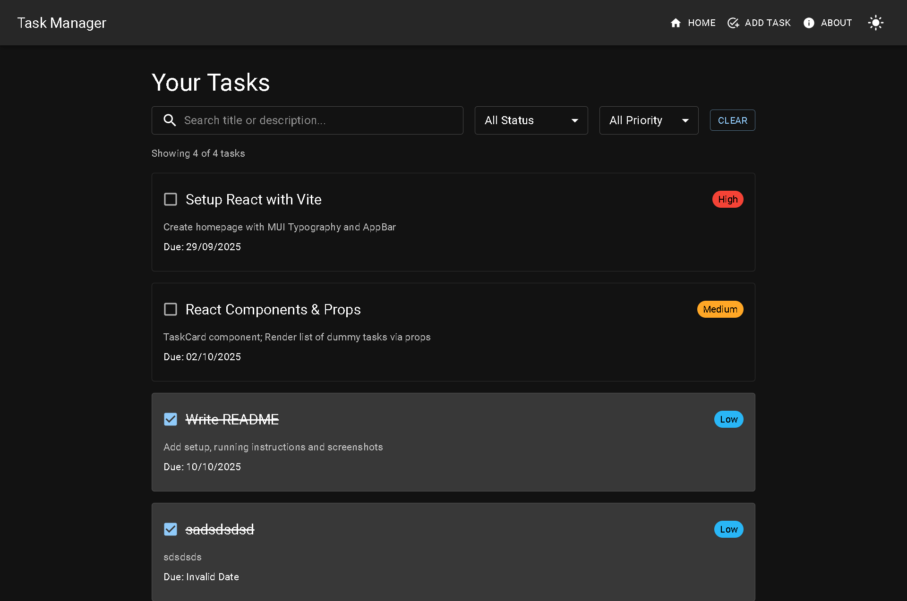
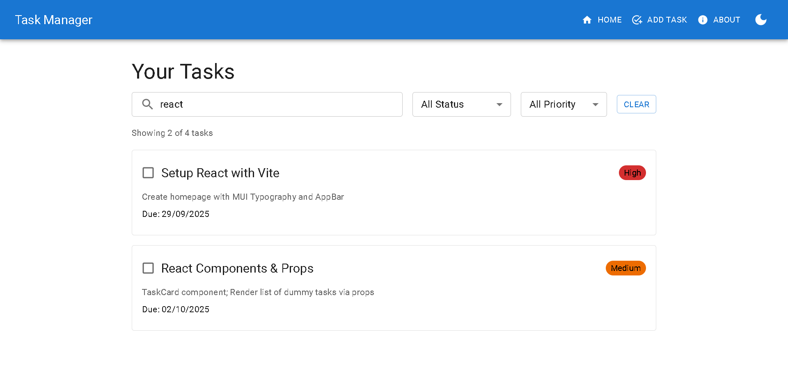
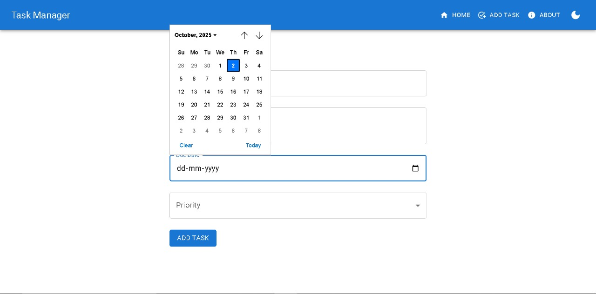
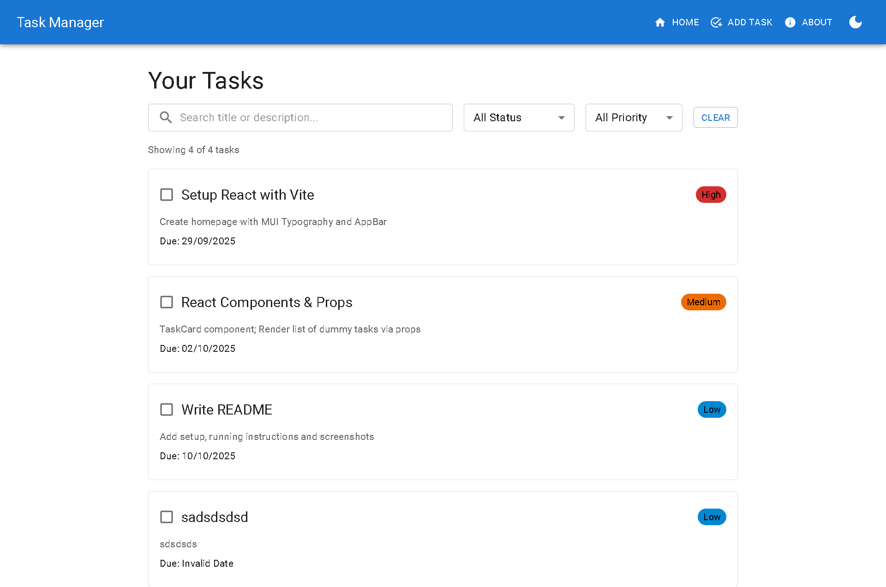
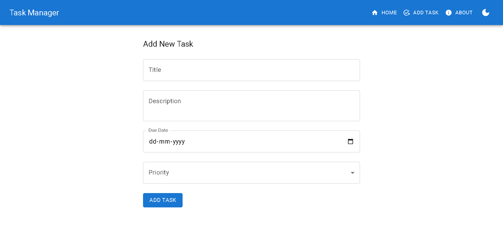
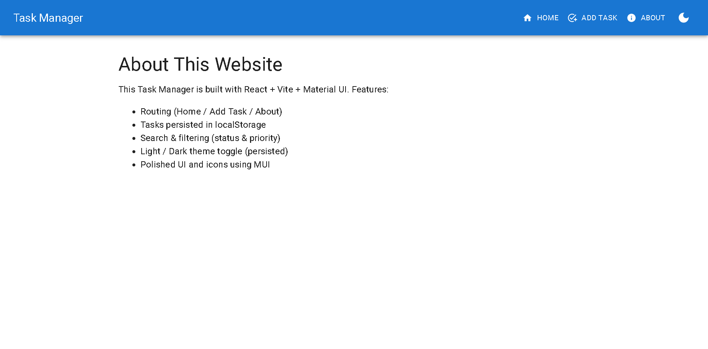
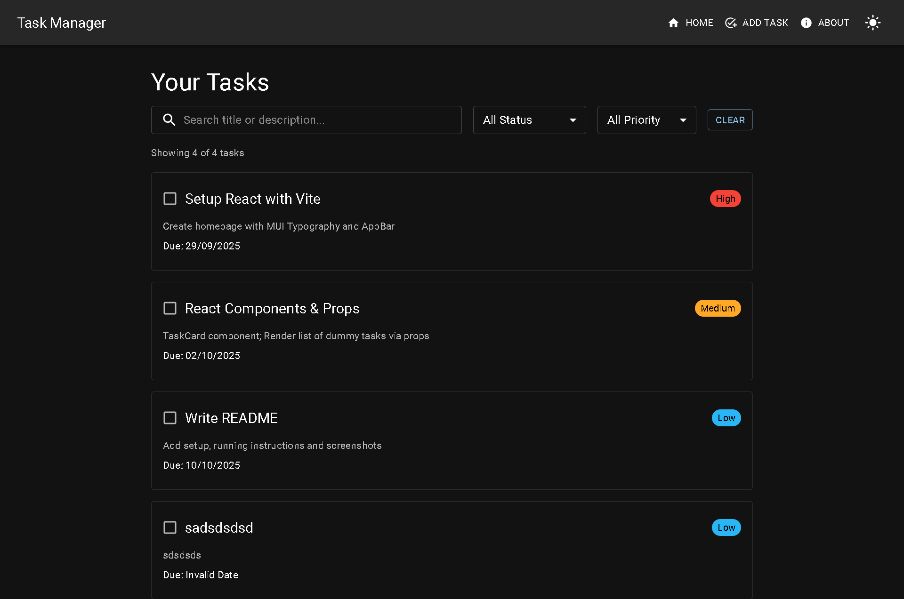

# Week 2 Day 5 - [Oct 4]

## 📌 Day 5 Task – Search, Filter, Theme Toggle, and Local Storage

- On Day 5, I enhanced the Task Manager application by adding search, filter, theme toggle, and localStorage persistence on top of the existing task CRUD system.

## 🔍 Search Functionality

- A search bar allows users to filter tasks by typing part of the title or description.
- It updates in real-time as the user types.
- Example: typing "react" will show only tasks where the title or description contains “react”.

### Added a dropdown to filter tasks by status:

- All → Show every task.
- Pending → Show only tasks that are not completed.
- Completed → Show only tasks marked as completed.

## Priority Filter

- Another dropdown lets users filter tasks by priority:
- High, Medium, Low, or All.

## Light/Dark Theme Toggle

- Introduced a theme toggle (light ↔ dark mode).
- The entire UI (forms, cards, and buttons) automatically adapts to the selected theme.
- Improves usability and gives a polished, professional look.

## Dynamic Task Count

- A small counter shows “X of Y tasks”, so users know how many tasks match their filters out of the total.
- All tasks are stored in the browser’s localStorage so that data is saved even when the page is refreshed.

## When the app loads:

- It retrieves tasks from localStorage (if any exist).
- Otherwise, it uses default sample tasks.
- When a task is added, updated, or marked completed, the new task list is automatically saved to localStorage.
- This ensures that users don’t lose their tasks after closing the browser or refreshing the page.

## Task Card Enhancements

### Each task card clearly shows:

- Title (with strikethrough when completed).
- Description, Due Date, and Priority.
- Completion status using a checkbox.
- Users can toggle tasks between Pending and Completed with one click.

## Calender in Addtask :

- Gives Calender option so the user can add to any dates wanted 

 
 

## Extra Images

### Home Page :

### AddTask Page :

### About Page :

### Theme Changer :

