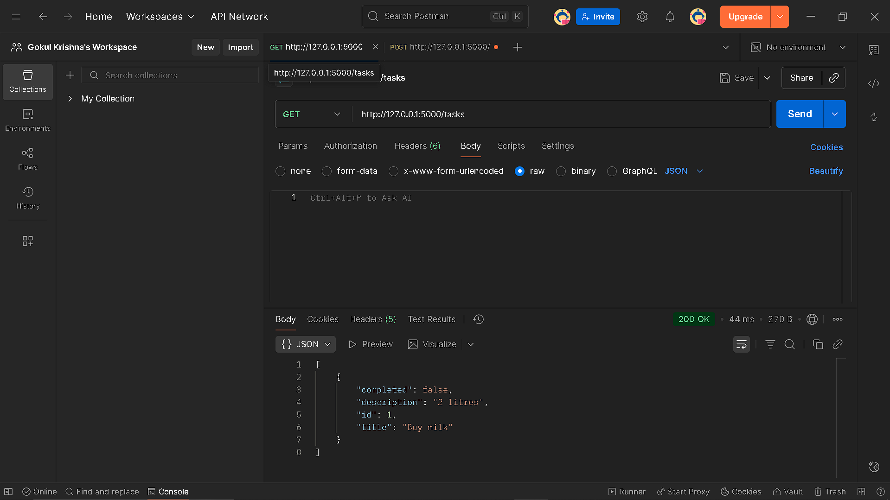

# Flask Task API (Week 3 Day 1) - [Oct 6]

A simple Flask project with REST API endpoints for managing tasks.

Implements:
- Project structure with `app/` folder
- Basic “Hello World” route (`/`)
- `GET /tasks` — fetch all tasks
- `POST /tasks` — create a new task
- In-memory storage (resets on server restart)

---

## Project Structure

```
my-flask-app/
├─ venv/
├─ app/
  ├─ init.py
  ├─ routes.py
  ├─ static/
  └─ templates/
├─ run.py
├─ requirements.txt
└─ README.md
```

---

## Setup & Run

### 1. Clone / download this repo

```
git clone <repo-url>
cd my-flask-app
```

### 2. Create virtual environment

#### Windows (PowerShell):
```
python -m venv venv
.\venv\Scripts\Activate.ps1
```
### 3. Install dependencies
```
pip install -r requirements.txt
```

### 4. Run the app
```
python run.py
```
**Server will start at http://127.0.0.1:5000/.**<br>
The Output in the server will be **Hello, World!**

### Testing :

```
Open Postman → New Request.
```

#### For GET /tasks:
```
Method: GET
```
Paste **URL: http://127.0.0.1:5000/tasks**

#### For POST /tasks:

```
Method: POST
```
Paste **URL: http://127.0.0.1:5000/tasks**
```
Body → raw → JSON
Paste JSON
{
  "id": 1,
  "title": "Buy milk",
  "description": "2 litres",
  "completed": false
}
```
**Now Cilck Send in POST**

 --- 


---

**Now Cilck Send in GET**

---


---