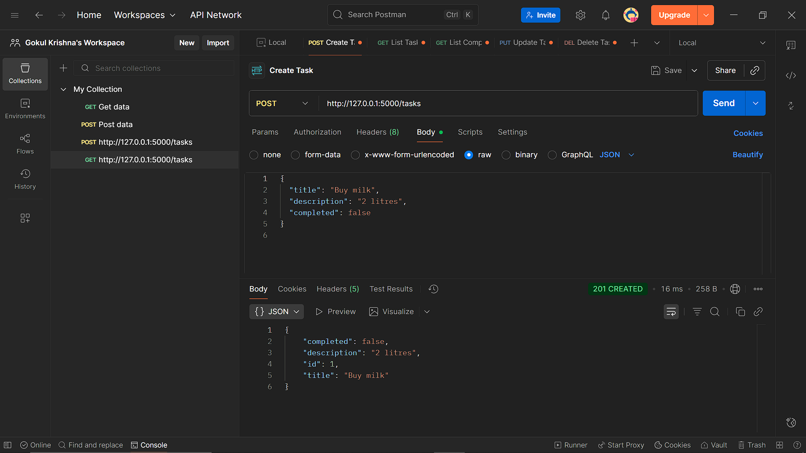
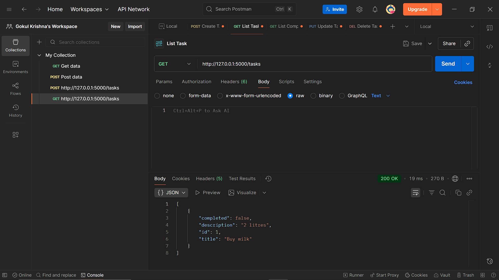
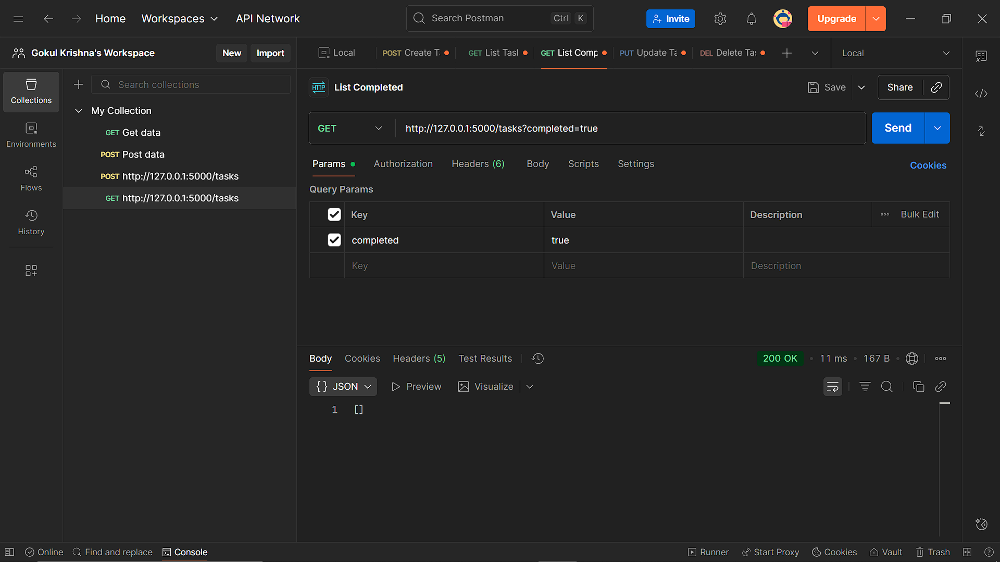
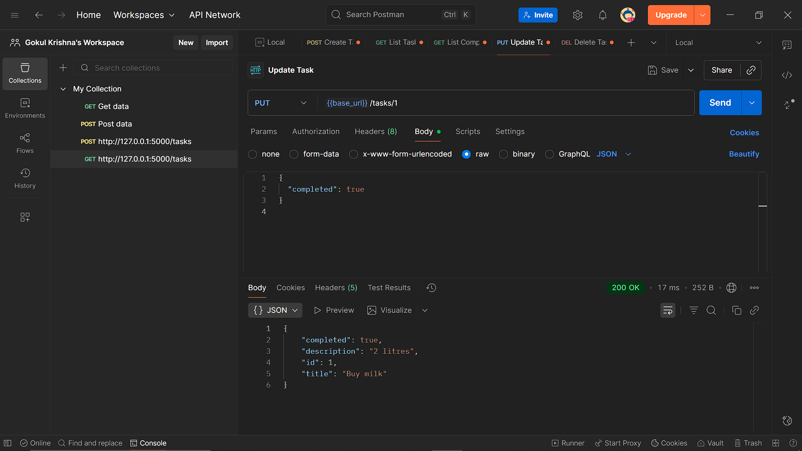
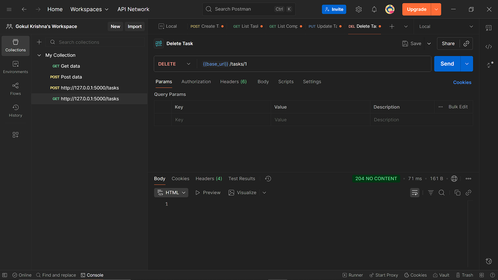

# Flask Task Manager API (Week 3 Day 2) - [Oct 8]

## Learning Topics

- HTTP Methods: PUT & DELETE
- Parameter passing in URLs
- Path vs Query parameters

## Step 1 - Project Structure

```bash
my-flask-app/
├─ venv/
├─ app/
  ├─ init.py
  ├─ routes.py
  ├─ static/
  └─ templates/
├─ run.py
├─ requirements.txt
└─ README.md
```

---

## Setup & Run

### 1. Clone / download this repo

```bash
git clone <repo-url>
cd my-flask-app
```

### 2. Create virtual environment

#### Windows (PowerShell)

```bash
python -m venv venv
.\venv\Scripts\Activate.ps1
```

### 3. Install dependencies

```bash
pip install -r requirements.txt
```

### 4. Install Flask

```bash
pip install flask
```

### 4. Run the app

```bash
python run.py
```

**Server will start at <http://127.0.0.1:5000/>.**

## Step 2 - Testing with Postman

### A. Create Task (POST /tasks)

- New Request → name it Create Task.

**Request**bash

```bash
POST http://127.0.0.1:5000/tasks
```

**Body (raw → JSON)**bash

```bash
{
  "title": "Buy milk",
  "description": "2 litres",
  "completed": false
}
```

**Expected Response (201 Created)**bash

```bash
{
  "id": 1,
  "title": "Buy milk",
  "description": "2 litres",
  "completed": false
}
```

---



---

### B. List All Tasks (GET /tasks)

New Request → List Tasks

**Request**bash

```bash
GET http://127.0.0.1:5000/tasks
```

**Expected Response (200 OK)**bash

```bash
[
  {
    "id": 1,
    "title": "Buy milk",
    "description": "2 litres",
    "completed": false
  }
]
```

---



---

### C. Filter Tasks (GET /tasks?completed=true)

- New Request → List Completed
- Method: GET
- Click Params tab (under the URL) and add:
- Key: completed Value: true

**Expected Response**bash

```bash
Postman will show {{base_url}}/tasks?completed=true
```

---



---

### D. Update Task (PUT /tasks)

- New Request → Update Task
- Method: PUT

**Request**bash

```bash
URL: {{base_url}}/tasks/1
```

**Body (raw → JSON)**bash

```bash
{
  "completed": true
}
```

**Expected Response :**

```bash
If exists: 200 OK and updated task JSON returned.
If not exists: 404 with {"error":"Task not found"}
If no JSON body: 400 with {"error":"JSON body required"}
```

---



---

### E. Delete Task (DELETE /tasks/)

- New Request → Delete Task
- Method: DELETE

**Request**bash

```bash
{{base_url}}/tasks/1
```

**Expected Response**bash

```bash
If deleted: status 204 No Content (body empty).
If not found: 404 with {"error":"Task not found"}
```

---



---

**THE END**bash
