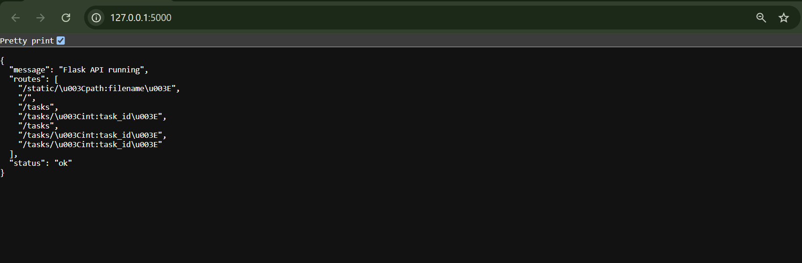
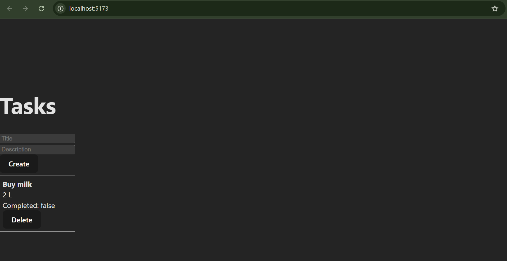

# Flask + React Task Manager (Week 3 Day 2) - [Oct 8]

- A simple Task Manager application demonstrating a Flask REST API backend with a React (Vite) frontend
- Includes input validation, error handling, CORS, and frontend integration

## Project Structure

```bash
project-root/
 ├─ backend/
 │  ├─ venv/               
 │  ├─ app.py              
 │  └─ requirements.txt     
 └─ frontend/
 └─ Vite React app files
```

## Backend Setup (Flask API)

Open terminal in backend folder

Create and activate virtual environment

Backend

```bash
cd backend
.\venv\Scripts\Activate.ps1
pytest -q
```

Install dependencies

```bash
pip install --upgrade pip
pip install flask flask-cors pytest
```

Verify requirements.txt

```bash
Flask
flask-cors
pytest
```

Run Flask app

```bash
python app.py
```

Flask server runs at <http://127.0.0.1:5000/>

---


---

### Using Curl ADD TASK

```bash
curl -i -X POST http://127.0.0.1:5000/tasks -H "Content-Type: application/json" -d "{\"title\":\"Buy milk\",\"description\":\"2 L\",\"completed\":false}"
```

---


---

## Frontend Setup (React + Vite)

Install dependencies

```bash
npm install
```

Run development server

```bash
npm run dev
```

React server runs at <http://localhost:5173/>

---


---

### Frontend Features

- Task List: Displays all tasks from Flask API
- Create Task Form: Add new tasks with title, description, and completed status
- Automatic refresh: TaskList updates when new tasks are added
- Error handling: Shows validation or server errors in UI

## ERROR HANDLERS

### 400

```bash
@app.errorhandler(400)
def handle_400(e):
    desc = getattr(e, "description", str(e))
    return jsonify({"error": "Bad Request", "message": desc}), 400
```

### 404

```bash
@app.errorhandler(404)
def handle_404(e):
    return jsonify({"error": "Not Found", "message": str(e)}), 404
```
