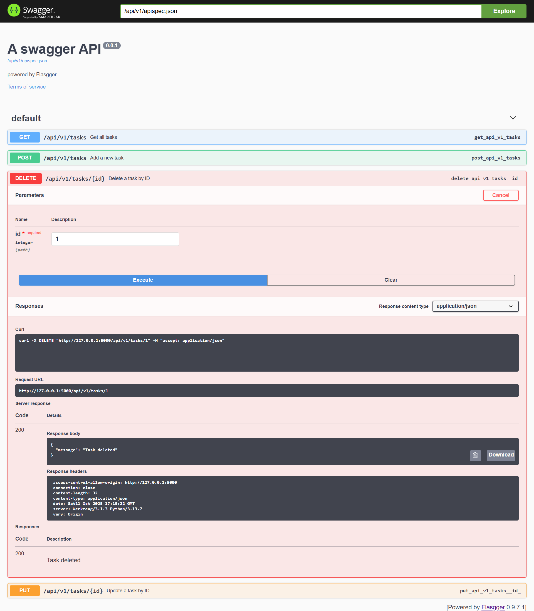

# Swagger API — Week 3 Day 4 [Oct 10]

## Learning Tasks

- Write docs
- Version the API
- Test deployment locally

### Project structure

```bash
swagger-api/
├── app.py
├── openapi.yaml
├── requirements.txt
└── README.md
```

### Create & activate a virtual environment

```bash
python -m venv venv
.\venv\Scripts\Activate.ps1
```

### Install dependencies

```bash
pip install flask flasgger flask-cors
```

Generate **requirements.txt**

```bash
pip freeze > requirements.txt
```

### Run the app

```bash
python app.py
```

**Running on <http://127.0.0.1:5000>**

---


---

## Test with curl

Create a task

```bash
curl -i -X POST http://127.0.0.1:5000/api/v1/tasks \
  -H "Content-Type: application/json" \
  -d "{\"title\":\"Buy milk\",\"completed\":false}"
```

Get tasks

```bash
curl -i http://127.0.0.1:5000/api/v1/tasks
```

Update task

```bash
curl -i -X PUT http://127.0.0.1:5000/api/v1/tasks/1 \
  -H "Content-Type: application/json" \
  -d "{\"title\":\"Buy bread\",\"completed\":true}"
```

### OR

### Test from Swagger

Go to

**<http://127.0.0.1:5000>**

### Scroll to POST

 /api/v1/tasks section — it’s usually under “Tasks”.

Click the blue **Try it out** button on the right.

In the Example Value box, replace the default JSON with your own data, for example:

```bash
{
  "title": "Buy Milk",
  "completed": True
}
```

Click **Execute**.

---


---

### Scroll to PUT

**Put id = 1**.

```bash
{
  "title": "Brought Milk",
  "completed": True
}
```

Click **Execute**.

---


---

### Scroll to GET

Click **Execute**.

---


---

### Scroll to DELETE

**Put id = 1**.

Click **Execute**.

---



---
