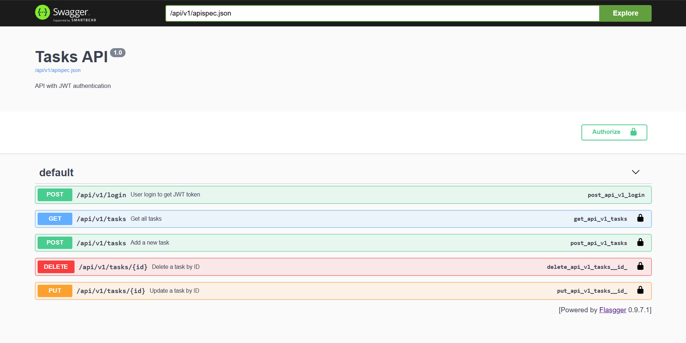
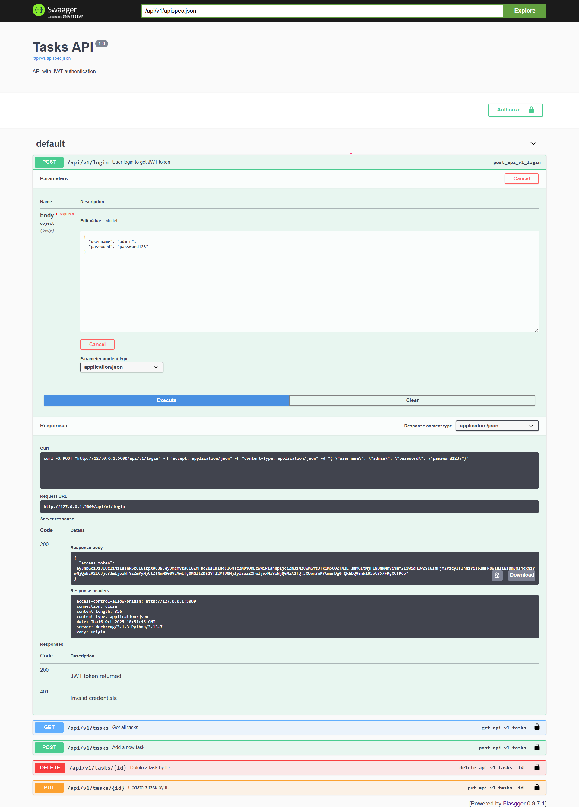
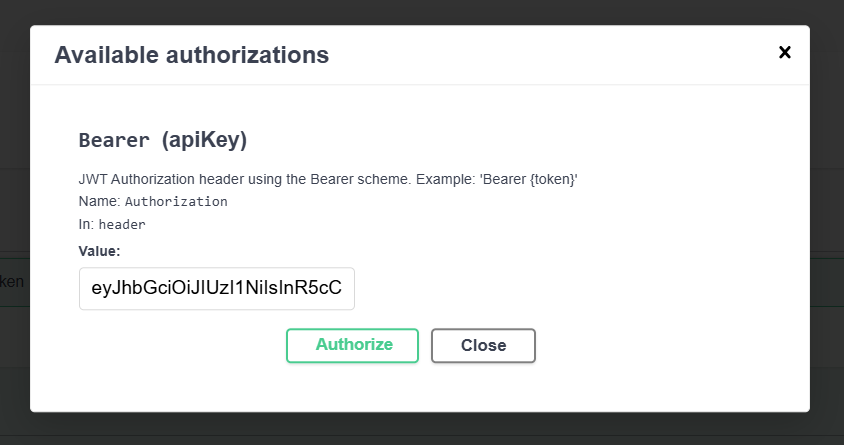

# Tasks API with JWT Authentication Week 3 Day 5 [Oct 11]

## Project Overview

This is a Flask-based REST API for managing tasks, integrated with JWT token-based authentication. The API includes Swagger UI for documentation and testing, and supports CORS for cross-origin requests.

### Project structure

```bash
swagger-api/
├── app.py
├── openapi.yaml
├── requirements.txt
└── README.md
```

### Create & activate a virtual environment

```bash
python -m venv venv
.\venv\Scripts\Activate.ps1
```

### Install dependencies

```bash
pip install flask flask-cors flasgger flask-jwt-extended
```

Generate **requirements.txt**

```bash
pip freeze > requirements.txt
```

### Run the app

```bash
python app.py
```

**Running on <http://127.0.0.1:5000>**

---



### API Endpoints

- Login to get JWT token
- URL: /api/v1/login
- Method: POST

```bash
Body:

{
  "username": "admin",
  "password": "password123"
}
```

- Response: JWT access token.
- Purpose: Authenticate and get a token for protected routes.

---



---

### Get all tasks

- URL: /api/v1/tasks
- Method: GET
- Headers: Authorization: Bearer **token**.

---



---
