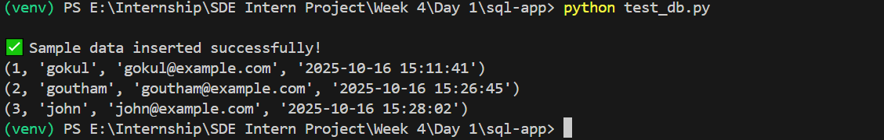

# Flask App Setup - Week 4 Day 1 [Oct 13]

## Task to do

- Design schema for tasks
- Fields such as id, title, description, status, due_date
- Create tables

## Project Structure

```bash
sql-app/
│
├── create_db.py
├── schema.sql
└── test_db.py
│
├── venv/
└── __pycache__/
```

### Create Project Folder

```bash
mkdir sql-app
cd sql-app
```

### Create Virtual Environment

```bash
python -m venv venv
venv\Scripts\activate
```

### Run it

In PowerShell

```bash
python test_db.py
```

### OutPut

---


---
