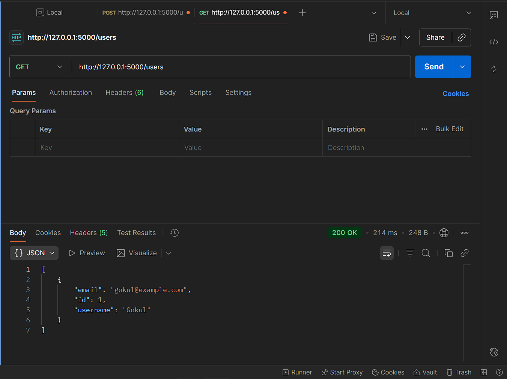

# Flask CRUD API - Week 4 Day 1 [Oct 13]

## Project Overview

This project is a simple **Flask API** connected to an **SQLite database** using **SQLAlchemy ORM**, implementing **CRUD operations** for a `User` table. All endpoints are tested in **Postman**.

---

## Folder Structure

```bash
flask_crud_app/
│
├── app.py
├── models.py
├── requirements.txt
└── venv/
```

---

## What I Have Done

**Installed required packages**.

```bash
   - Flask
   - Flask-SQLAlchemy
```

**Created the Flask app** in `app.py` and connected it to SQLite:

```bash
   - Initialized database
   - Created all tables
```

**Implemented CRUD operations**:

```bash
   - **Create** → POST `/users`
   - **Read** → GET `/users`
   - **Update** → PUT `/users/<id>`
   - **Delete** → DELETE `/users/<id>`
```

**Added a homepage route** `/` to verify the server is running in a browser

**Tested all endpoints using Postman**  

---

## Steps in Postman

### 1. Create User (POST)

```bash
- URL: http://127.0.0.1:5000/users.
- Method:POST
```

**Body (raw, JSON)**:

```bash
{
  "username": "Gokul",
  "email": "gokul@example.com"
}
```

Expected Response:

```bash
{
    "msg": "User created"
}
```

---


---

### 2. Read Users (GET)

**URL: <http://127.0.0.1:5000/users>**.

**Expected Response**:

```bash
[
  {
    "email": "gokul@example.com",
    "id": 1,
    "username": "Gokul"
  }
]
```

---


---

### 3. Update User (PUT)

**URL: <http://127.0.0.1:5000/users/1>**.

```bash
{
  "username": "Gokul Krishna",
  "email": "gokulkrishna@example.com"
}
```

**Expected Response**:

```bash
{
    "msg": "User updated"
}
```

---


---

### 4 Delete User (DELETE)

**URL: <http://127.0.0.1:5000/users/1>**.

**Expected Response**:

```bash
{
    "msg": "User deleted"
}
```

---


---
