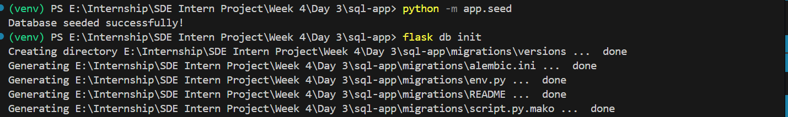
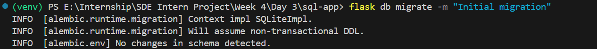
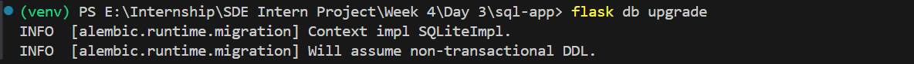
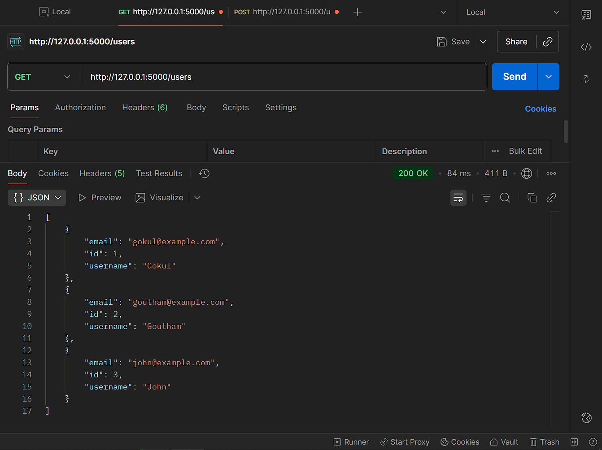

# SQL-App Project - Week 4 Day 1 [Oct 13]

This is a Flask-based project for learning and implementing basic CRUD operations, database seeding, filtering/search, query parameters, indexing, and migrations using Flask-Migrate.

---

## **Project Folder Structure**

```bash
sql-app/
│
├─ app/
│ ├─ init.py
│ ├─ models.py
│ ├─ routes.py
│ ├─ seed.py
│
├─ migrations/
│
├─ venv/
├─ config.py
├─ app.py
└─ requirements.txt
```

---

## **Setup & Installation**

### **Create and activate virtual environment**

```bash
python -m venv venv
venv\Scripts\activate
```

```bash
pip install flask flask_sqlalchemy flask_migrate
pip freeze > requirements.txt
```

```bash
SQLALCHEMY_DATABASE_URI = "sqlite:///app.db"
SQLALCHEMY_TRACK_MODIFICATIONS = False
```

**class User(db.Model):**

```bash
    id = db.Column(db.Integer, primary_key=True)
    username = db.Column(db.String(50), nullable=False)
    email = db.Column(db.String(120), unique=True, index=True, nullable=False)
```

**Seeding the Database**.

Seed the database with sample data using app/seed.py:

```bash
python -m app.seed
Sample users added:
```

```bash
Gokul → gokul@example.com
Goutham → goutham@example.com
John → john@example.com
```

**Flask Routes / API**.

- Defined in app/routes.py:
- Get all users / Search users:

```bash
GET /users
GET /users?username=Gokul
GET /users?email=gokul@example.com
```

### Filtering/search is implemented using query parameters

- Returns JSON with user data.

Flask-Migrate for Database Schema Changes
Initialize migrations (first time only):

```bash
flask db init
```

---


---

```bash
flask db migrate -m "Initial migration"
```

---


---

```bash
flask db upgrade
```

---


---

### Using Postman

- Create a new request.
- Method → GET
**URL → <http://127.0.0.1:5000/users>**
- Click Send


