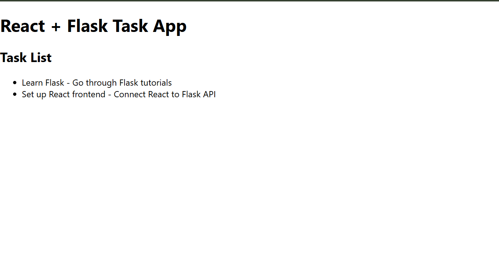

# Database Migrations, Setup & React Connection - Week 4 Day 1 [Oct 14]

## Learning Topics

- Database migrations using Flask-Migrate
- DB setup & seeding scripts
- Handling blank data and DB errors
- Connecting React frontend with DB-backed API

## Project Folder Structure

```bash
sql-app/
│
├── backend/
│   ├── app.py
│   ├── config.py
│   ├── models.py
│   ├── requirements.txt
│   ├── migrations/
│   ├── routes/
│   │   ├── __init__.py
│   │   └── tasks.py
│   ├── database/
│   │   ├── __init__.py
│   │   └── db_setup.py
│   ├── instance/
│       └── app.db
│
└── frontend/
    ├── package.json
    ├── src/
        ├── App.js
        ├── components/
        │   └── TaskList.js
        ├── services/
            └── api.js
```

## Backend Setup

### Create Virtual Environment

```bash
cd backend
python -m venv venv
venv\Scripts\activate
```

### Install Dependencies

```bash
pip install flask flask_sqlalchemy flask_migrate flask_cors
```

### Migrations Setup

```bash
flask db init
flask db migrate -m "Initial migration"
flask db upgrade
```

**This creates the database file inside backend/instance/app.db**.

**Run:**

```bash
python -m database.db_setup
```

## Frontend Setup

### Create React App

**From the root folder**.

```bash
npx create-react-app frontend
```

### Go inside and install Axios

```bash
cd frontend
npm install axios
```

### Running the Project

```bash
Run the Backend (Flask)
cd backend
python app.py
```

**Backend URL → <http://127.0.0.1:5000>**

### Run the Frontend

```bash
cd frontend
npm start
```

**Frontend URL → <http://localhost:3000>**

---


---
