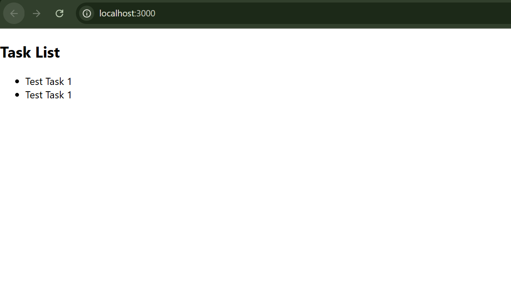

# Frontend Connection & Error Handling - Week 4 Day 1 [Oct 14]

## Objective

- Connect the React frontend to the Flask + SQLite backend API, and handle:
- blank data
- empty/no tasks
- database connection errors

## Folder Structure

```bash
project/
│
├── backend/
│   ├── app.py
│   ├── db_setup.py
│   ├── database.db
│   ├── models/
│   │   └── tasks_model.py
│   └── __pycache__/
│
└── frontend/
    ├── src/
    │   ├── App.js
    │   ├── components/
    │   │   └── TaskList.js
    │   └── services/
    │       └── api.js
    ├── package.json
    └── public/
```

## Backend Setup

### Create & activate a virtual environment

```bash
python -m venv venv
venv\Scripts\activate  # (Windows)
```

### Install dependencies

```bash
pip install flask flask-cors
```

## Frontend Setup

### Create React app

```bash
npx create-react-app frontend
cd frontend
```

### Install Axios

```bash
npm install axios
```

### Run the App

**Backend**.

```bash
python app.py
```

**Check → <http://127.0.0.1:5000>**

**Response:**

```bash
{"message":"API is running"}
```

**Frontend**.

```bash
npm start
```

**Runs → <http://localhost:3000>**

---


---

## Error Handling Logic

### Scenario Behavior

- Database connection error Shows "Unable to load tasks. Please check backend connection."
- Empty DB table Shows "No tasks found."
- Successful fetch Displays full task list
- CORS or network error Caught by React .catch() and shown on screen

**Expected Output**.

```bash
[
  {"id": 1, "title": "Test Task 1"},
  {"id": 2, "title": "Test Task 2"}
]
```

**Frontend (Browser UI)**.

```bash
Task List
Test Task 1
Test Task 2
```

## Frontend connection

- Connected your React app (localhost:3000) to your Flask API (localhost:5000).
- Handled CORS via flask-cors.
- Verified API working from both backend and frontend (tasks loading).

### Error handling for DB

- Set up backend error handling — returning clear JSON errors like:

```bash
return jsonify({'error': 'Database connection failed'}), 500
```

- Handled try/except blocks in Flask routes to catch DB issues.

### Edge cases

- Handled blank DB (showing “No tasks available” or “Unable to load tasks”).
- Handled backend error (500 Internal Server Error handled gracefully).
- Handled empty data or failed API calls in React using .catch().
