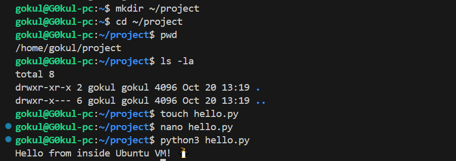
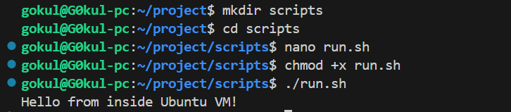

# Linux Basics + Multipass Setup - Week 5 (Day 1) [Oct 21]

### Tasks :
- Install Multipass.
- Launch Ubuntu VM, SSH into VM, Practice CLI commands (ls, cd, touch, nano, rm, chmod, sudo).
- Install Python, Git, curl, net-tools, Setup simple folder & run Python script inside.

## Enable required Windows features (WSL + Virtual Machine Platform)

Run these in an Admin PowerShell:

**Enable WSL and the Virtual Machine Platform**
```bash
dism.exe /online /enable-feature /featurename:VirtualMachinePlatform /all /norestart
dism.exe /online /enable-feature /featurename:Microsoft-Windows-Subsystem-Linux /all /norestart
```
**Then reboot the PC.**

**After reboot, open Admin PowerShell again:**

### Ensure WSL 2 is default
```bash
wsl --set-default-version 2
```

## Use WSL Ubuntu in VS Code

#### Step 1 — Open VS Code

- Just open Visual Studio Code normally (from your Windows desktop/start menu).

#### Step 2 — Install the WSL Extension

- Click the Extensions icon on the left sidebar (or press Ctrl + Shift + X).
- Search for "WSL".
- Install the one named "Remote - WSL" (official from Microsoft).

#### Step 3 — Connect to Ubuntu

- After installing, in VS Code:
- Press Ctrl + Shift + P to open the Command Palette.

Type:

- Remote-WSL: New WSL Window
- Choose Ubuntu (your WSL distribution).

#### Step 4 — Open Terminal Inside VS Code

- Press Ctrl + ` (backtick) or go to:
- Terminal → New Terminal
- You should see something like:
```bash
gokul@DESKTOP-XXXX:~$
```

#### Step 5 - Install a Linux distro (Ubuntu):
```bash
wsl --install -d Ubuntu-22.04
```

## First Launch and User Setup

After installation completes, it will automatically open a terminal like:
```bash
Installing, this may take a few minutes...
Please create a default UNIX user account:
Enter new UNIX username: gokul
New password:******
```

## Create your project folder

**Inside your VM:**
```bash
mkdir ~/project
cd ~/project
```

### Create and edit a Python script

Make a test file:
```bash
touch hello.py
nano hello.py
```

Then paste this inside nano:
```bash
def main():
    print("Hello from inside Ubuntu VM!")

if __name__ == "__main__":
    main()
```

Save and exit:

**Press Ctrl + O, Enter to save**

**Press Ctrl + X to exit nano**

---


---

## Practice Linux commands
```bash
ls -la             # list files
pwd                # show current directory
cd ~               # go to home directory
mkdir test_dir     # make a folder
touch test.txt     # make empty file
nano test.txt      # open text editor
cat test.txt       # view file content
rm test.txt        # delete file
rmdir test_dir     # remove empty folder
chmod +x hello.py  # make python file executable
sudo apt update    # run admin command
```

### Once inside Ubuntu, update it and install essentials:
```bash
sudo apt update && sudo apt upgrade -y
sudo apt install python3 python3-pip git curl net-tools -y
```

**Check versions:**
```bash
python3 --version
pip3 --version
git --version
curl --version
ifconfig
```

## Make it executable and run directly

Let’s make the file executable like a shell command:
```bash
chmod +x hello.py
```

**Add a shebang line at the top of the file:**
```bash
nano hello.py
```

Add this as the first line:
```bash
#!/usr/bin/env python3
```

Now save (Ctrl+O → Enter → Ctrl+X) and run again:

Now run it directly:
```bash
./hello.py
```

### Add another script folder
```bash
mkdir scripts
cd scripts
nano run.sh
```

Paste this inside:
```bash
#!/bin/bash
python3 ../hello.py
```

Save and exit (Ctrl+O, Enter, Ctrl+X), then:
```bash
chmod +x run.sh
./run.sh
```

Output:

**Hello from inside the Ubuntu VM!**

---


---

## Folder Structure Summary
```bash
/home/gokul/project
├── hello.py
└── scripts/
    └── run.sh
```

### Tasks Completed:

- Installed Multipass and launched an Ubuntu VM.
- SSH’d (shell access) into the VM.
- Practiced core Linux CLI commands — ls, cd, touch, nano, rm, chmod, sudo.
- Installed all required tools: Python 3, Git, curl, and net-tools.
- Created a project folder (~/project).
- Wrote and ran a Python script (hello.py) successfully.
- Made the script executable and ran it directly using ./hello.py