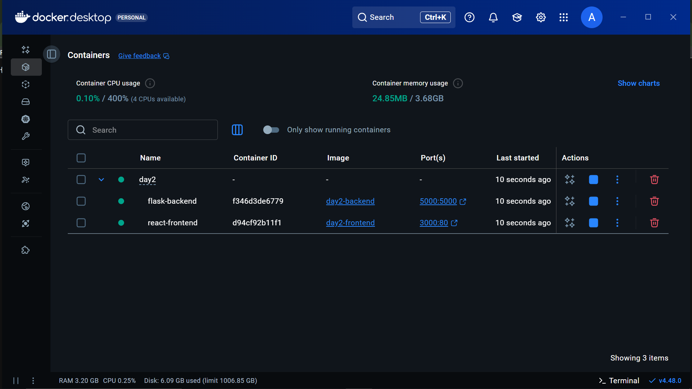

# Dockerfile for Backend & Frontend - Week 5 [Oct 23]

## Tasks to do

- Create Dockerfiles for Flask (backend) and React (frontend)
- Build and run Docker images locally
- Test API endpoints and frontend UI

## Folder Structure

```bash
project/
│
├── backend/
│   ├── app.py
│   ├── requirements.txt
│   ├── Dockerfile
│   └── ...
│
├── frontend/
│   ├── Dockerfile
│   ├── package.json
│   ├── src/
│   │   └── App.js
│   └── ...
│
└── docker-compose.yml
```

## Setup - Backend

### From project root

```bash
docker build -t flask-backend .
docker run -d -p 5000:5000 flask-backend
```

Check running containers:

```bash
docker ps
```

You should see something like:

```bash
CONTAINER ID   IMAGE           COMMAND           CREATED          STATUS          PORTS
                       NAMES
e25b19805cf8   flask-backend   "python app.py"   28 seconds ago   Up 30 seconds   0.0.00:5000->5000tcp,
[::]:5000->5000/tcp   funny_dewdney
```

Test:

**Go to <http://localhost:5000/api>**

## Setup - Frontend

### From project root - Frontend

```bash
docker build -t react-frontend .
docker run -d -p 3000:80 react-frontend
```

Check running containers:

```bash
docker ps
```

You should see something like:

```bash
CONTAINER ID   IMAGE            COMMAND                  CREATED          STATUS          PORTS
                 NAMES
67e3afd013f2   react-frontend   "/docker-entrypoint.…"   4 minutes ago    Up 4 minutes    0.0.0.0:3000->80/tcp, [::]:3000->80/tcp       interesting_liskov
```

Test:

**Go to <http://localhost:5000/api>**

### Docker File for backend

```bash
FROM python:3.10-slim

WORKDIR /app

COPY requirements.txt .

RUN pip install --no-cache-dir -r requirements.txt

COPY . .

EXPOSE 5000

CMD ["python", "app.py"]
```

### Docker File for frontend

```bash
FROM node:18 AS build

WORKDIR /app
COPY package*.json ./
RUN npm install
COPY . .
RUN npm run build

FROM nginx:alpine

COPY --from=build /app/build /usr/share/nginx/html

EXPOSE 80
CMD ["nginx", "-g", "daemon off;"]

```

### In Docker Desktop

---


---

## Task Completed

```bash
- Wrote backend Dockerfile:
- Tested API → got {"message":"Hello from Flask backend!"}.

- Wrote frontend Dockerfile:
- Connected frontend and backend via Docker Compose:
- Created docker-compose.yml with backend and frontend services.

Tested final setup:

Backend API: <http://localhost:5000/api>
 → JSON response.

Frontend UI: <http://localhost:3000>
 → displayed backend message
```
